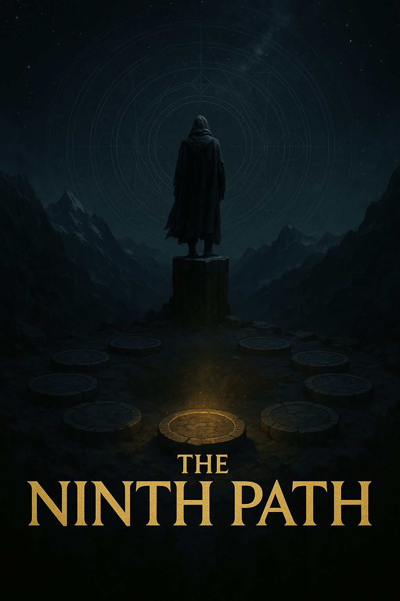

# The Ninth Path
*A Skyrim SE/AE Modlist for the Seeker Beyond the Stars*

> *“Eight paths were walked by mortals. The ninth was forged by man becoming god.”*

## Contents
- [Preamble](#preamble)
- [List Contents](#list-contents)
- [System Requirements](#system-requirements)

## Preamble

**The Ninth Path** is a lore-heavy, spiritually charged Skyrim SE/AE modlist built around high-stakes choices, fate-bending consequences, and the silent war between divinity and mortality. Inspired by philosophical and esoteric themes, this list invites you to walk a path few have dared — beyond gods, beyond Daedra, beyond time.

If you enjoy:
- Mystical exploration and forgotten truths
- Moral ambiguity and personal consequence
- Prophecy, fate, and the illusion of choice
- Ancient ruins, lost worlds, and impossible timelines

Then *The Ninth Path* was made for you.

---

## List Contents

The full list of mods can be found on [Load Order Library](https://loadorderlibrary.com/lists/nordic-souls).

A more in-depth look at the mods used can be found in the [gameplay guide](https://github.com/Geborgen/nordic-souls/blob/main/GAMEPLAYGUIDE.md).

## System Requirements

| Minimum | Recommended |
|-----|-----|
| Intel i5-9400 / AMD Ryzen 5 2600 | Intel i5-13400 / AMD Ryzen 5 5600x  |
| NVIDIA GTX 1060 / AMD RX 580 | NVIDIA RTX 3060 TI / AMD RX 6700 |
| 16 GB DDR3 | 32 GB DDR4 |
| SATA SSD | NVMe SSD |
